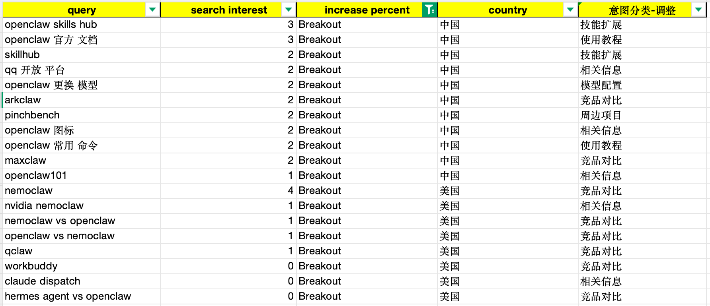

# 竞品分析

## 背景

我使用 Google Trend 功能围绕 OpenClaw 进行了关键词的搜索意图分析，结果存储在：
[Google Trend 数据](../openclaw_google_trend.xlsx)

其中我选取了最近一个月搜索上升势头最快的一批词（文档中 increase percent 列标有 'breakout' 的词），见截图：

## 任务

我希望围绕 OpenClaw 开发一个相关的内容网站，主要提供五大类内容：

- 教程：与 OpenClaw 相关的使用教程。包括安装部署、配置、添加技能。
- 对比：与 OpenClaw 类似或基于 OpenClaw 进行包装的同类竞品介绍、对比。
- 案例：如何利用 OpenClaw 的技能完成实际的日常任务。
- 快讯：与 OpenClaw 相关的最新资讯、更新、功能介绍。
- 问答：某些与 OpenClaw 相关的高频问题回答。

现在我正处于寻找竞品进行对比的阶段。其中：`https://openclaw101.dev/` 是一个对比的参考基准。我希望你帮我进行全面的竞品研究。

## 竞品研究需求

请围绕以下维度展开详细分析：

- **首页内容布局与转化路径**：拆解竞品首页的内容板块构成、视觉引导路径及核心转化点（Call to Action），分析其如何引导用户留存。
- **反链与流量获取渠道**：参考 [外链数据](../openclaw101_外链.xlsx) 文档，用表格梳理竞品在哪些高权重网站（域名）投放了外链。并推测其核心流量获取渠道（如自然搜索、社交媒体等）。
- **内容差异化竞争策略**：基于前文提供的 breakout 关键词和我规划的五大内容板块，制定内容竞争策略。明确如何避免同质化，打造独特的内容优势（例如：在基础教程外，提供哪些进阶内容或独特的呈现格式）。
- **SEO 与关键词拓扑架构**：从 SEO 优化角度，规划首页的核心关键词，以及二级、三级页面的长尾关键词分布，形成结构清晰的关键词树和内链布局方案。
- **受众画像与未满足需求**：评估竞品目标用户的核心痛点，观察其是否有社区（如 Discord/Reddit 等）或评论互动，找出竞品尚未覆盖的用户场景。
- **商业变现模式研究**：分析竞品目前的盈利手段（如广告赞助、付费会员、联盟营销等），为项目的商业化路径提供参考。
- **技术表现与用户体验**：简要评估竞品网站的加载性能、移动端适配情况及整体交互体验。

## 约束

- 将调研结果放在 `doc/` 目录下，命名为 `竞品调研分析结果.md`。
- 遵循 MarkdownLint 的规范。
- 论证要有理有据。所有描述性文本均用中文表示，所有图表（包括图表标题、图例等）均用英文表示。
- 只能基于我提供的文档、数据、截图进行分析，不得捏造虚假数据。
- **行文风格**：保持专业、客观的商业分析语调，避免使用过于口语化或网络流行语。
- **文档排版**：输出的报告结构需尽量扁平化，避免过深的标题层级嵌套，建议使用加粗的列表项来组织层级信息。
